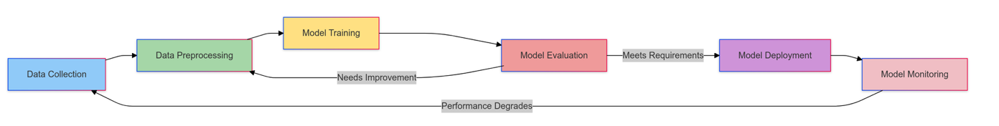

# Machine Learning Systems - Introduction

There have always been defining moments in human history.

- 18th and 19th centuries -> Industrial Revolution (significant advancements every century)
- 20th century -> Digital Revolution (significant advancements every decade)
- 21st century -> AI Revolution (significant advancements every year!)

## AI vs ML

- Artificial Intelligence - Create machines that match or exceed human intelligence. These machines should be able to think, reason and adapt (like an intelligent agent)
- Machine Learning - Scientific approach to understand how systems learn and improve frome experience (provides theory for building intelligent systems)

## Siginificant events

- 1950 - Turing published "Computing Machinery and Intelligence"
- 1956 - First AI workshop in Darmouth by McCarthy
- 1957 - Rosenblatt invents **perceptron**
- 1966 - ELIZA chatbot (early NLP program) by Weizenbaum
- 1979 - Stanford cart by Moravec, first autonomous vehicle
- 1997 - IBM's Deep Blue beats Kasparov
- 2011 - IBM's Watson wins at Jeopardy
- 2020 - GPT-3 was introduced by OpenAI
- 2025 - GPT-o3 seems to perform really well across multiple SWE, AGI benchmarks

## Evolution of AI

1. Symbolic AI (1956 - 1974) - Rule-based systems
2. Expert Systems (1970s - 1980s) - Knowledge-based systems, sourced from human experts
3. Statistical Learning (1990s)
   Influenced by Moore's Law, more data and computational power, algorithms like SVM, Random Forests and Neural Networks.

   ```markdown
   Example: Early Spam Detection Systems
   Rule-based (1980s):
   IF contains("viagra") OR contains("winner") THEN spam

   Statistical (1990s):
   P(spam|word) = (frequency in spam emails) / (total frequency)

   Combined using Naive Bayes:
   P(spam|email) ∝ P(spam) × ∏ P(word|spam)
   ```

   Because of this,

   1. Quality of training data became important.
   2. Needed metrics for evaluating models.
   3. Tension between precision (being right when you make a prediction) and recall (catching all the cases), so have to consider tradeoffs.

4. Shallow Learning (2000s)
   Decision trees (make choices like flowchart), KNN (classify based on similarity), Linear and logistic regression (predict continuous and binary outcomes), SVM (find hyperplane that separates classes by using the kernel trick), etc.

   ```markdown
   Example: Image Classification
   Shallow Learning:

   - Extract features (edges, corners, etc.)
   - Train classifier (SVM, Random Forest, etc.)
   - Predict class

   Deep Learning:

   - Train end-to-end model
   - Predict class
   ```

5. Deep Learning (2012 - Present)
   Neural networks with multiple layers, can learn complex patterns, used in image and speech recognition, NLP, etc.

   This was first introduced in 2012 by AlexNet, which won the ImageNet competition. Since then, there have been many advancements in the field. Massive modles, like GPT-3 are called foundation models, which are over 1000 times larger than AlexNet, containing 175 billion parameters.

In summary, the field needed three ingredients to evolve to this stage and take it to the next level,

1. Data - More data for complex networks
2. Compute - More powerful GPUs and TPUs
3. Algorithms - Training these very deep networks

### Overview

| Aspect                 | Symbolic AI                       | Expert Systems               | Statistical Learning             | Shallow / Deep Learning             |
| ---------------------- | --------------------------------- | ---------------------------- | -------------------------------- | ----------------------------------- |
| **Key Strength**       | Logical reasoning                 | Domain expertise             | Versatility                      | Pattern recognition                 |
| **Best Use Case**      | Well-defined, rule-based problems | Specific domain problems     | Various structured data problems | Complex, unstructured data problems |
| **Data Handling**      | Minimal data needed               | Domain knowledge-based       | Moderate data required           | Large-scale data processing         |
| **Adaptability**       | Fixed rules                       | Domain-specific adaptability | Adaptable to various domains     | Highly adaptable to diverse tasks   |
| **Problem Complexity** | Simple, logic-based               | Complicated, domain-specific | Complex, structured              | Highly complex, unstructured        |

## Machine Learning Systems Engineering

Machine Learning Systems Engineering (MLSysEng) is the discipline of designing, implementing, and operating artificially intelligent systems across computing scales—from resource-constrained embedded devices to warehouse-scale computers

## Machine Learning Systems

A machine learning system is an integrated computing system comprising three core components: (1) data that guides algorithmic behavior, (2) learning algorithms that extract patterns from this data, and (3) computing infrastructure that enables both the learning process (i.e., training) and the application of learned knowledge (i.e., inference/serving). Together, these components create a computing system capable of making predictions, generating content, or taking actions based on learned patterns.

## ML Systems Lifecycle

Traditional SDLC is a predictable lifecycle. It contains systems dervied from decades of established practices consisting - VCS, CI/CD, testing, deployment, monitoring, etc. However MLSys derive their patterns from data, not code which traditional SDLC is built upon. This introduces a new set of challenges.

### Challenges

1. Data - Dynamic in nature. Changes in data can affect the model's performance. Traditional SDLC only changes when source code is updated. Not the case here.
2. Testing - Traditional testing is deterministic. However, testing ML models is probabilistic.
3. Monitoring - Traditional monitoring is based on system metrics. However, ML models are based on data and model metrics.
4. All stages in lifecycle are deeply interconnected. Changes in one stage can affect the other stages.
5. Broad spectrum - Cloud-based systems, mobile devices, IoT devices, etc require different approaches - Edge ML, Mobile ML, Enterprise ML, etc.
6. Privacy and Security - Data privacy and security are critical in ML systems. Data can be used to infer sensitive information.
7. Ethics - Bias, fairness, transparency, accountability, etc are important in ML systems.

### Lifecycle



## Emerging Trends

1. Agentic Systems - Systems that can act autonomously and make decisions on behalf of humans.
2. Specialized AI Accelerators - Hardware accelerators for AI workloads.
3. Efficient ML - Efficient training and inference of ML models.
4. Federated Learning - Training models on decentralized data.

## Real World Applications

1. FarmBeats - Microsoft's AI for agriculture. Uses IoT devices to collect data and ML models to predict crop yield. Uses AI to optimize irrigation and fertilization.
2. AlphaFold - DeepMind's AI for protein folding. Predicts protein structures from amino acid sequences.
3. Autonomous Vehicles - Waymo, Tesla, etc. use ML models for self-driving cars.

# DNN Architectures

Represents a convergence of computational patterns from building block of modern AI systems.

When we map the algorithmic requirement of these patterns to computer system design, we need to consider the following:

1. Memory access patterns - How data moves through memory hierarchy
2. Computation characteristics - The nature and organization of arithmetic operations
3. Data movement - Requirements for on-chip and off-chip data transfer
4. Resource utilization - How computational and memory resources are allocated

## Multi-Layer Perceptron (MLP)

This requires dense pattern processing.

Sometimes we need a pattern that is capable of learning arbitray relationships across all input features. This is achieved by enabling the following - allow unrestricted feature interactions, learned feature importance and adaptive representation.

### Algorithmic Structure

It is a feedforward neural network that maps input data to output data. It consists of an input layer, hidden layers and an output layer. Each layer is fully connected to the next layer. This can be represented by,

h(l) = f(W(l)h(l-1) + b(l))

where h(l) is the output of the l-th layer, W(l) is the weight matrix, b(l) is the bias vector and f is the activation function.

### Computational Patterns

1. Dense matrix multiplication - The core operation in MLP is dense matrix multiplication. This is used to compute the output of each layer.

### System Implications

When analyzing how computational patterns impact computer systems, we examine these three dimensions - memory requirements, computation characteristics and data movement.

- Memory requirements - The weight matrices, bias vectors and intermediate results are stored in memory. The size of these matrices and vectors is determined by the number of neurons in each layer. Every forward pass must access these matrices and vectors. Hence, we can optimize the memory requirements through data organization and reuse.
- Computation characteristics - The core operation in MLP is dense matrix multiplication. This operation is compute-bound and requires high arithmetic intensity. This means that the operation requires a high number of arithmetic operations per memory access. We can optimize the computation characteristics through advancements in modern hardware. Parallelism across multiple processing units, accelerators using specialized matrix multiplication units, etc.
- Data movement - The data movement in MLP is dominated by the movement of weight matrices and intermediate results. The weight matrices are large and must be transferred between memory hierarchy levels. The intermediate results are generated at each layer and must be transferred to the next layer. We can optimize data movement through data staging and transfer optimization.

## Convolutional Neural Networks (CNN)

While MLPs treat each input feature independently, CNNs exploit the spatial locality of input data. This is useful for image and video processing.

### Pattern Processing

Spatial pattern processing appears in many AI applications. This has two key requirements - the ability to detect local patterns and the ability to recognize them regardless of their position.

### Algorithmic Structure

CNNs are feedforward neural networks that use convolutional layers to process input data. Each convolutional layer applies a set of filters to the input data to extract features. That is, it processes local neighborhoods of the input data to detect patterns. This can be represented by,

H(l) i,j,k = f(Σ Σ Σ W(l) i,j,k,m,n,o H(l-1) i+m,j+n,k-1 + b(l))

where H(l) i,j,k is the output of the l-th layer, W(l) i,j,k,m,n,o is the filter weights, H(l-1) i+m,j+n,k-1 is the input data and f is the activation function.

### Computational Patterns

1. Convolution - The core operation in CNNs is convolution. This operation is used to apply filters to the input data to extract features.

### System Implications

- Memory requirements - We need to consider the filter weights and the feature maps. The filter weights are stored in memory and must be accessed during convolution. The feature maps are generated at each layer and must be stored in memory. We can optimize memory requirements through weight reuse and careful feature map management.
- Computation characteristics - The core operation in CNNs is the convolution which has a regular, repeated nature. This operation is compute-bound and requires high arithmetic intensity. We can optimize computation characteristics through structured parallelism.
- Data movement - The data movement in CNNs is dominated by the movement of filter weights and feature maps. The filter weights are large and must be transferred between memory hierarchy levels. The feature maps are generated at each layer and must be transferred to the next layer. We can optimize data movement through data reuse and minimizing redundant feature map accesses.

## Recurrent Neural Networks (RNN)

RNNs are used for sequence processing. They are useful for time series data, speech recognition, etc.

### Pattern Processing

Sequential pattern processing appears in many AI applications. The key challenge is to maintain and update relevant context over time. This requires the ability to process sequences of data and learn temporal dependencies. Unliek MLPs and CNNs which process fixed size inputs, sequential processing requires handling variable length inputs.

### Algorithmic Structure

RNNs are feedforward neural networks that use recurrent connections to process sequences of data. Each recurrent layer maintains a hidden state that captures the context of the input sequence. This can be represented by,

ht = f(Whhh(t-1) + Wxhx(t) + b)

where ht is the hidden state at time t, Whh is the recurrent weight matrix, Wxh is the input weight matrix, x(t) is the input at time t, f is the activation function and b is the bias vector.

### Computational Patterns

1. Recurrent computation - The core operation in RNNs is recurrent computation. This operation is used to update the hidden state at each time step.

### System Implications

- Memory requirements - We need to consider the recurrent weight matrix, the input weight matrix and the hidden state. The recurrent weight matrix and the input weight matrix are stored in memory and must be accessed during recurrent computation. The hidden state is generated at each time step and must be stored in memory. We can optimize memory requirements through weight reuse and hidden state management.
- Computation characteristics - The core operation in RNNs is recurrent computation which has a sequential nature. This operation is compute-bound and requires high arithmetic intensity. We can optimize computation characteristics through pipelining, batching, sequence packing, etc.
- Data movement - The data movement in RNNs is dominated by the movement of weight matrices and hidden states. The weight matrices are large and must be transferred between memory hierarchy levels. We can optimize data movement through data reuse and minimizing redundant hidden state accesses.

## Attention Mechanisms - Dynamic Pattern Processing

The previous architectures process patters in fixed ways. However, many AI applications require dynamic pattern processing. In language translation, for example, the model must focus on different parts of the input sentence at different times.

## Basic Attention Mechanism

### Algorithmic Structure

Attention mechanisms are used to dynamically focus on different parts of the input data. This can be represented by,

Attention(Q, K, V) = softmax(QK^T / √d) V

where Q, K and V are the query, key and value matrices, respectively. The attention mechanism computes a set of attention scores by comparing the query and key matrices.

### Computational Patterns

1. Attention computation - The core operation in attention mechanisms is attention computation. This operation is used to compute attention scores based on the query and key matrices.
2. Attention aggregation - The attention scores are used to aggregate the value matrix to produce the output.

### System Implications

- Memory requirements - We need to consider the query, key and value matrices. These matrices are stored in memory and must be accessed during attention computation. The intermediate attention weights becomes a significant memory requirement.
- Computation characteristics - Deal with two main phases: generating attention weights and applying them to values. This has a quadratic scaling with the sequence length.
- Data movement - The data movement in attention mechanisms is dominated by the movement of query, key and value matrices. These matrices are large and must be transferred between memory hierarchy levels.

These distinctive characteristics set up of the stage of more advanced architectures like Transformers.

## Transformers and Self-Attention

Key innovation is the use of self-attention layers.

### Algorithmic Structure

In this, the queries, keys and values are all derived from the same input. They also employ a multi-head attention which provides the model with a richer representation of the input data, enabling it to capture different types of relationships. The self attention mechanism can be represented by,

SelfAttention(Q, K, V) = softmax(XWQ(XWK)^T / √d) XWV

where X is the input data, WQ, WK and WV are the query, key and value weight matrices, respectively. The self attention mechanism computes a set of attention scores by comparing the input data.

### Computational Patterns

1. Self-attention computation - The core operation in transformers is self-attention computation. This operation is used to compute attention scores based on the input data.
2. Multi-head attention - The self-attention mechanism is applied multiple times in parallel to capture different types of relationships.

### System Implications

- self-attention enables parallel processing; more efficient computation
- attention score computation results in a quadratic scaling with the sequence length; computational bottleneck
- multi-head attention introduces additional computation and memory requirements; but enhances model's representational capacity
- involves large matrix multiplications; requires high arithmetic intensity
- self-attention also generates memory-internsive intermediate results; requires careful memory management

## Evolution of Deep Learning Architectures

| Era               | Dominant Architecture | Key Primitives             | System Focus                                 |
| ----------------- | --------------------- | -------------------------- | -------------------------------------------- |
| Early NN          | MLP                   | Dense Matrix Ops           | CPU optimization                             |
| CNN Revolution    | CNN                   | Convolutions               | GPU acceleration                             |
| Sequence Modeling | RNN                   | Sequential Ops             | Memory hierarchies                           |
| Attention Era     | Transformer           | Attention, Dynamic Compute | Flexible accelerators, High-bandwidth memory |

Key innovations during the following phases were,

- Perceptron to Multi-Layer Networks (layer stacking, non-linear transformations, feedforward computation, gradient-based learning, etc.)
- Dense to Spatial Processing (dense connectivity, skip connections, batch normalization, parameter sharing, etc.)
- Evolution of Sequence Processing (adaptive computation paths, attention mechanisms, etc.)
- Modern AI Architectures (innovate through clever use and refinement of existing primitives)

| Primitive Type | MLP                   | CNN                        | RNN                         | Transformer              |
| -------------- | --------------------- | -------------------------- | --------------------------- | ------------------------ |
| Computational  | Matrix Multiplication | Convolution (Matrix Mult.) | Matrix Mult. + State Update | Matrix Mult. + Attention |
| Memory Access  | Sequential            | Strided                    | Sequential + Random         | Random (Attention)       |
| Data Movement  | Broadcast             | Sliding Window             | Sequential                  | Broadcast + Gather       |

## System-Level Building Blocks

### Core Computational Primitives

- Matrix multiplication - used in MLPs for layer computations, CCNs reshape convolutions, etc. Can be exploited using modern hardware.
- Sliding window operations - used in CNNs for convolutional layers, etc. Can be transforming them into efficient matrix multiplications and mangaging memory hierarchy.
- Dynamic computation - emerged with attention mechanisms in Transformers, etc. Can be optimized using specialized hardware accelerators.

### Memory Access Primitives

- Sequential access - used in RNNs for sequence processing, etc. Most efficient. Can be optimized using modern hardwares using prefetching, caching, etc.
- Strided access - used in CNNs for convolutional layers, etc. Less efficient than sequential access. Can be optimized using caching sttrategies and specialized memory controllers.
- Random access - used in Transformers for attention mechanisms, etc. Not very efficient. Can be optimized using memory hierarchy and sophisticated prefetching.

| Architecture | Input Dependency | Parameter Storage | Activation Storage   | Scaling Behavior |
| ------------ | ---------------- | ----------------- | -------------------- | ---------------- |
| MLP          | Linear           | O(N × W)          | O(B × W)             | Predictable      |
| CNN          | Constant         | O(K × C)          | O(B × H_img × W_img) | Efficient        |
| RNN          | Linear           | O(h²)             | O(B × T × h)         | Challenging      |
| Transformer  | Quadratic        | O(N × d)          | O(B × N²)            | Problematic      |

Where:

- **N**: Input or sequence size
- **W**: Layer width
- **B**: Batch size
- **K**: Kernel size
- **C**: Number of channels
- **H_img**: Height of input feature map (CNN)
- **W_img**: Width of input feature map (CNN)
- **h**: Hidden state size (RNN)
- **T**: Sequence length
- **d**: Model dimensionality

### Data Movement Primitives

Moving data from off-chip memory typically requires 100-1000x more energy than performing a floating-point operation! Moving data is pretty important!

- Broadcast - used in MLPs for weight and bias broadcasting, etc. Can be optimized using data reuse and memory hierarchy.
- Scatter - used in CNNs for feature map generation, etc. Can be optimized using parrallelism (little challenging) and sophisticated work distribution algorithms.
- Gather - used in Transformers for attention mechanisms, etc. Can be optimized using atttention pattern, high-bandwith interconnects, and large caches.
- Reduction - used in all architectures for aggregation, etc. Can be optimized using tree-structured reduction networks, and parallel reduction algorithms.

### System Design Impact

- Specialized hardware - tensor processing units, tensor cores, etc.
- Memory heirarchies - high-bandwith memory, complex on-chip memory with multiple levels, etc.

| Primitive             | Hardware Impact           | Software Optimization    | Key Challenges             |
| --------------------- | ------------------------- | ------------------------ | -------------------------- |
| Matrix Multiplication | Tensor Cores              | Batching, GEMM libraries | Parallelization, precision |
| Sliding Window        | Specialized datapaths     | Data layout optimization | Stride handling            |
| Dynamic Computation   | Flexible routing          | Dynamic graph execution  | Load balancing             |
| Sequential Access     | Burst mode DRAM           | Contiguous allocation    | Access latency             |
| Random Access         | Large caches              | Memory-aware scheduling  | Cache misses               |
| Broadcast             | Specialized interconnects | Operation fusion         | Bandwidth                  |
| Gather/Scatter        | High-bandwidth memory     | Work distribution        | Load balancing             |

### Challenges

- Memory bandwith - models with large working sets or models that require frequent random access
- Communication overhead - models with large intermediate results or models using distributed training
- Complex trade-offs - between different primitives and their impact on system design

## Conclusion

- Modern AI architectures are built on a set of core computational primitives.
- Identifying these primitives can help us understand the system-level implications of different architectures.
- System-level building blocks can be optimized to improve the performance of AI systems.
- Challenges remain in optimizing memory access, data movement and computation for modern AI architectures.
