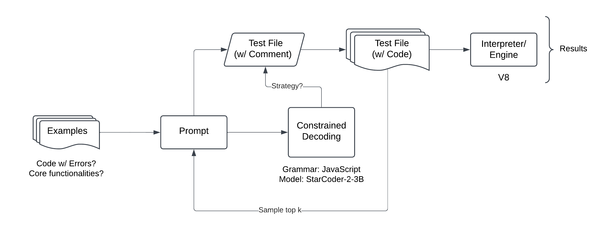

Current:

- able to get good runs w/ llguidance (for JSON/XML)
- evaluate outputs
- workflow
  

Next:

- continue working on fuzzing pipeline
- get consistent runs; collect data
- write LARK grammar for JavaScript
