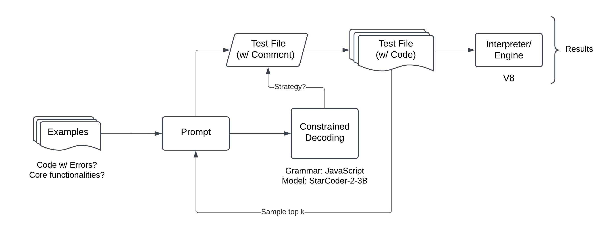

Current:

- improve generation throughput ()
- evaluation metrics (XML)
  - 
- workflow
  

Next:

- continue working on fuzzing pipeline
- get consistent runs; collect data
- write LARK grammar for JavaScript
