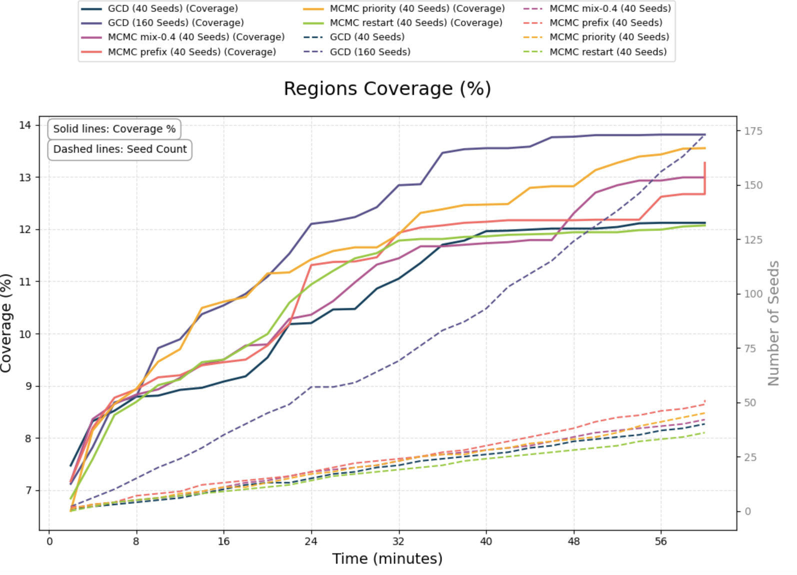
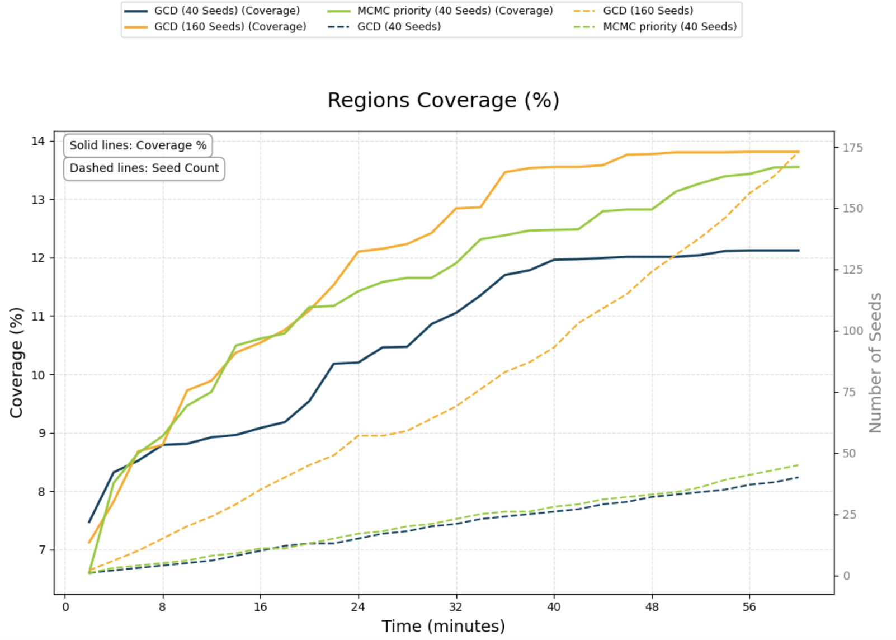

**Context:** I'm working on using constrained decoding for fuzzing structured data formats.

**Current:**

- Running experiments w/ GCD and MCMC on standard libxml2 benchmark

- Analysing coverage data:

  - For a single 1 hour session (single fuzzing campaign), we get ~15% coverage
  - But, we never reach some parts of the codebase
    - XML Schema Validation: ~20% of overall coverage -> Generate `.xsd` files
    - XPath: ~11% of overall coverage -> Generate XPath queries
    - RelaxNG: ~7% of overall coverage -> Generate `.rng` files
    - HTML: ~4% of overall coverage -> Generate `.html` files

- Viewing the corpus from a standard libxml2 benchmark (Magma),

| File Format          | Count |
| -------------------- | ----- |
| xml                  | 653   |
| xsd                  | 156   |
| rng                  | 99    |
| xpath                | 53    |
| html                 | 31    |
| dtd                  | 27    |
| sct                  | 15    |
| script               | 10    |
| ns                   | 10    |
| ent                  | 10    |
| ... 12 other formats | 30    |
| Total                | 1,100 |

**Next:**

- Modify our grammar to produce XSD, RNG, HTML, and XPath queries to target uncovered components
- Continue experiments - how long does it take us to generate a similar corpus distribution? How effective is it?

**Notes:**

- Incremental coverage seems ok for testing, but is not performant; Common way of testing vs benchmarks for LLM based fuzzing is to generate our corpus separately, and then run the fuzzer on it (since most benchmarks are docker containers w/out sufficient GPU support)
