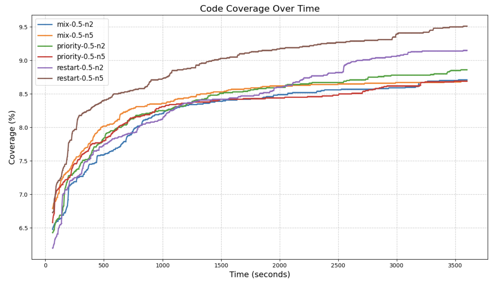
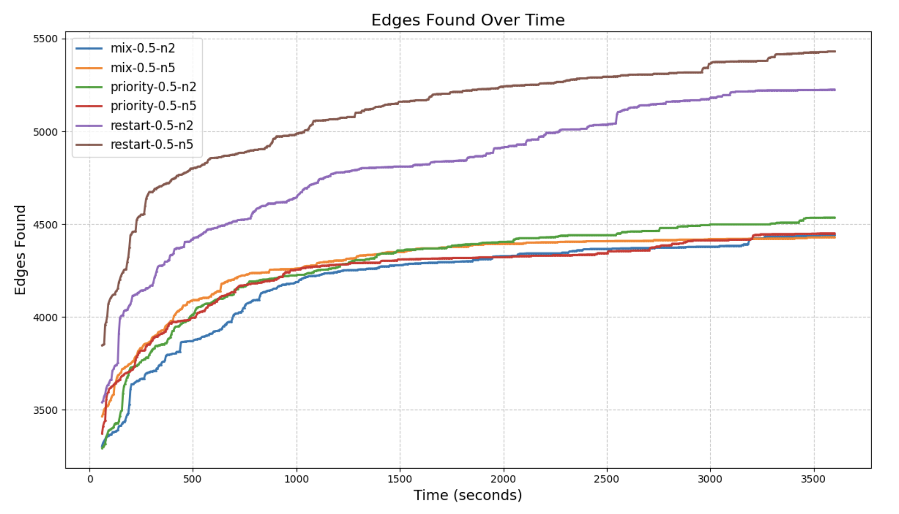
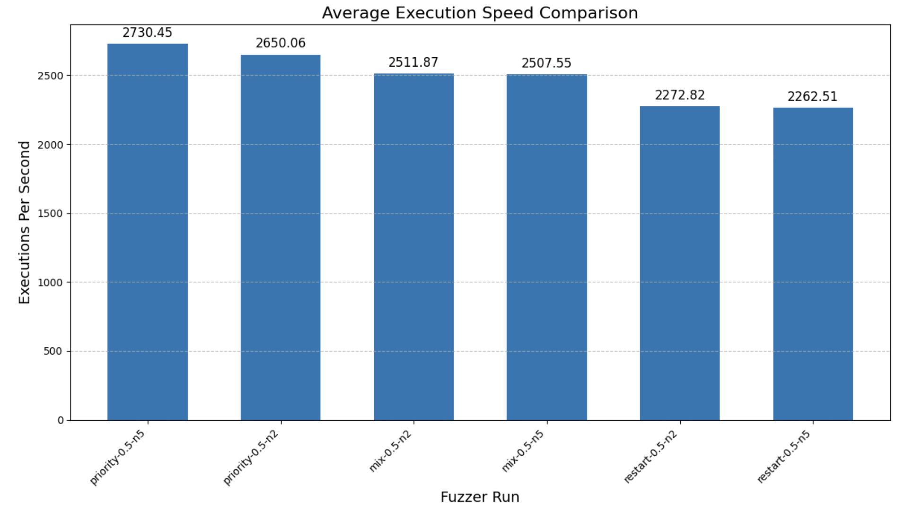
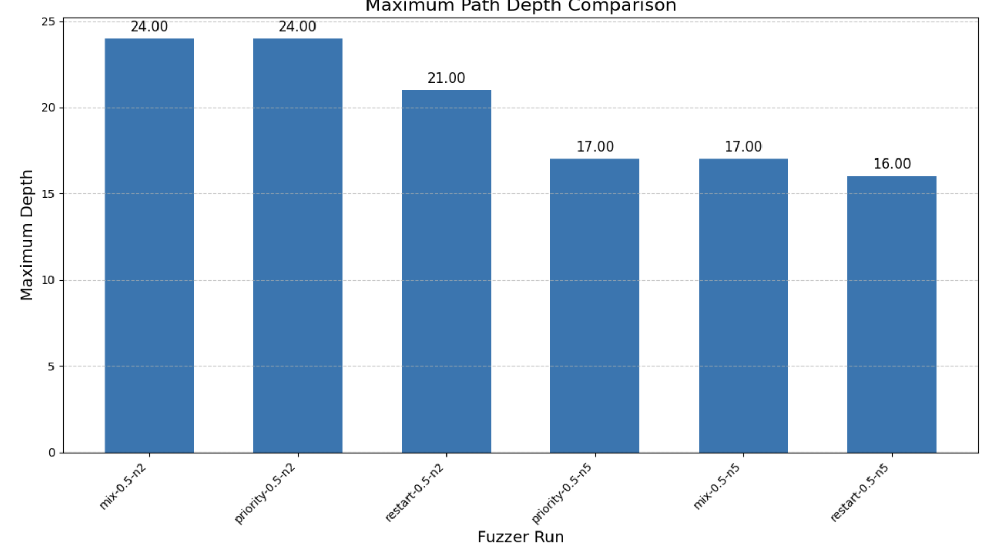
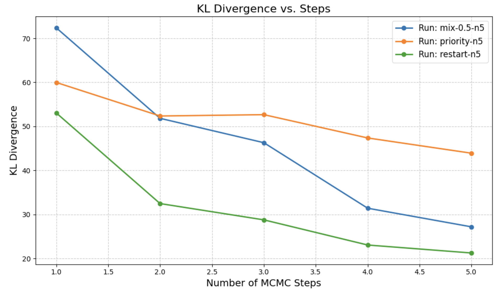
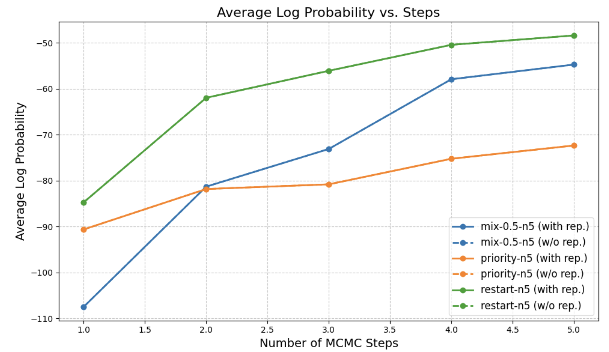

**Context:** I'm working on using constrained decoding for fuzzing structured data formats.

**Current:**

- Running experiments w/ GCD and MCMC on libxml2

- Changes from last week:
  - Only precomputed seeds (100) using GCD, MCMC (priority, restart, and mix-0.5)
  - Slightly different grammar (only namespaced elements) + prompt

### Coverage Metrics

- Only single trial (1 hour) for each experiment, need to run ~5 and average for - Computing seeds for higher n_steps, not part of this experiment

  
  

### Execution Metrics

- restart results in higher coverage with lower depth, need to verify this with more trials

### KL Divergence

- need higher n_steps
  
  
  
