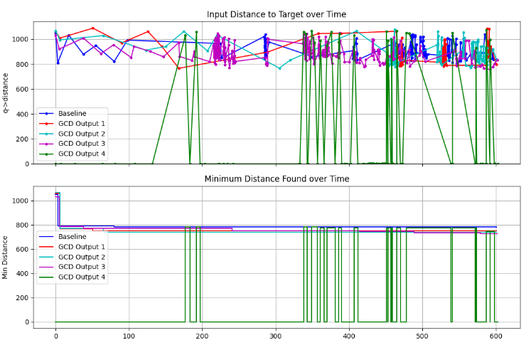

**Context:**

- I'm working on using constrained decoding for directed fuzzing of structured data formats.
- We use WAFLGo, a directed fuzzer to guide the fuzzing and give distance to target information.
- Currently, we evaluate on the XML benchmark (commit `ef709ce2`).

**Current:**

- Use a single XML seed as the baseline and monitor the distance to target sites.
- Manually construct variants of the grammar and use GCD to generate a new, valid seed from each.
  - The idea is to see if we are able to reach the target sites more effectively than the baseline.

**Next:**

- Generate a larger set of valid seeds for every grammar variant.
- Develop an pipeline to automate grammar mutations and systematically explore the grammar space to identify effective mutations for reaching target sites.
